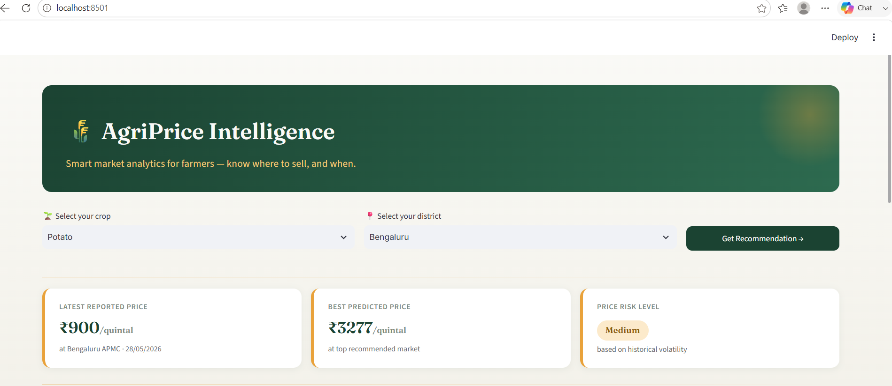
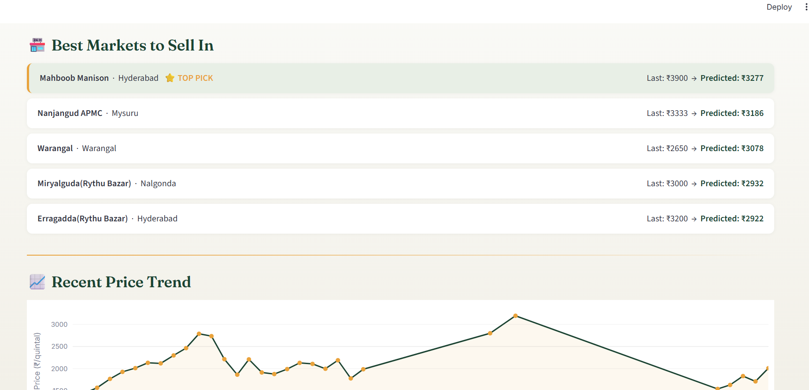
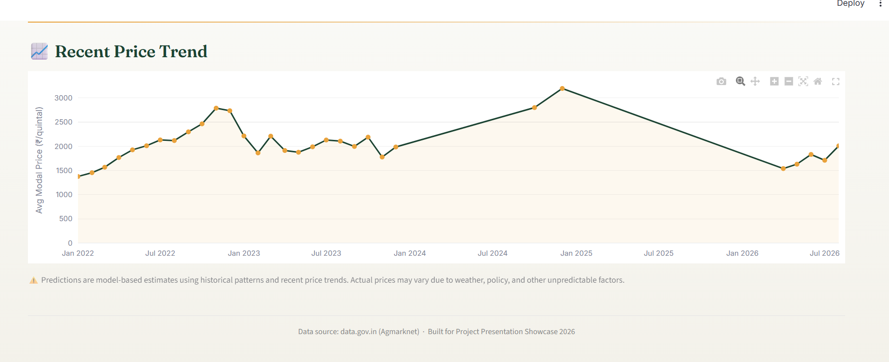
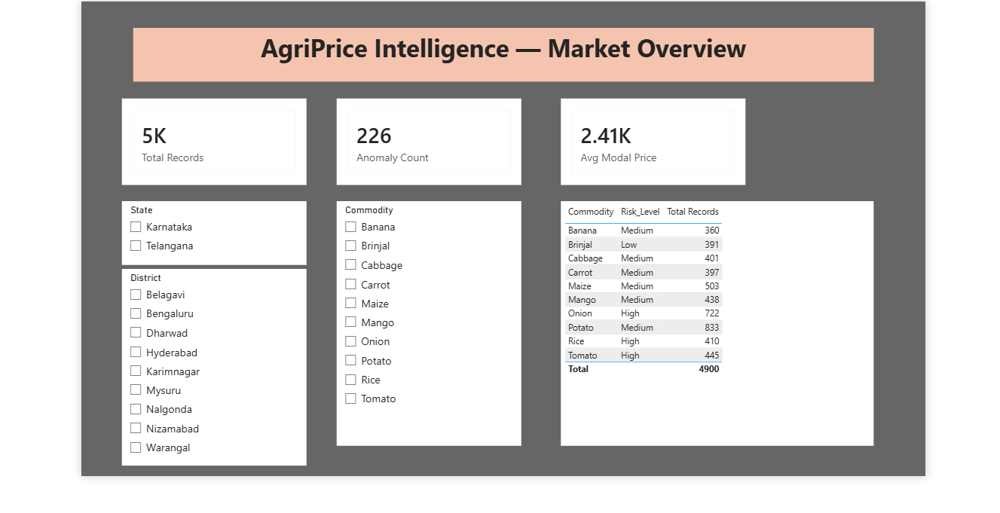
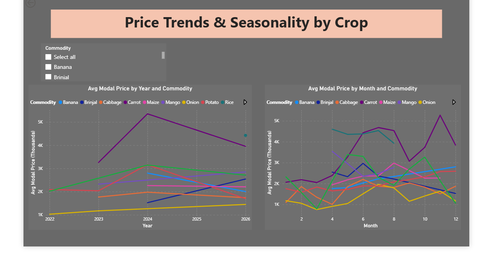
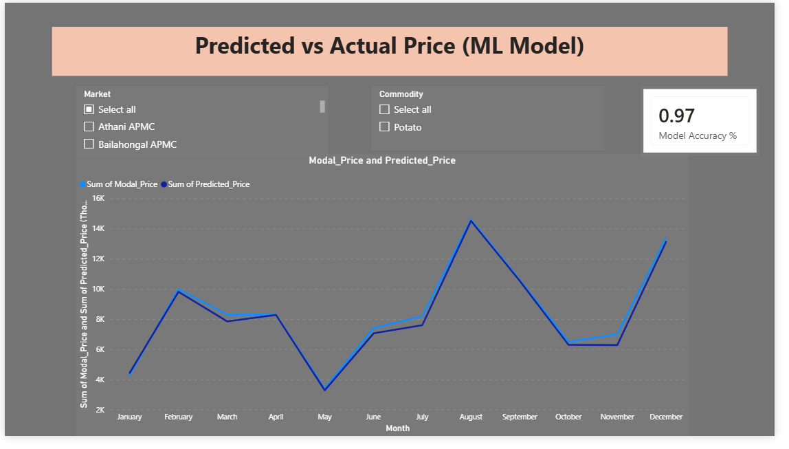

# 🌾 AgriPrice Intelligence: Smart Market Analytics for Farmers

*Helping farmers sell smarter using real government market data*

## Problem Statement

Farmers across India frequently sell their produce at a loss — not because
of poor crop quality, but because they lack visibility into price trends,
seasonal patterns, and better-paying nearby markets. Prices for the same
crop can vary significantly between mandis just a few kilometers apart,
and can swing sharply due to seasonality, oversupply, or demand shocks —
information most farmers have no easy way to access.

**AgriPrice Intelligence** turns real government mandi price data into two
things: a Power BI dashboard for deep market analysis, and a simple
farmer-facing app that answers one question directly — *where should I
sell, and what will I get for it?*

## Data Source

- **data.gov.in** — Variety-wise Daily Market Prices Data (Agmarknet API)
- Coverage: Telangana & Karnataka, 9 districts
- 10 crops: Onion, Tomato, Potato, Rice, Maize, Cabbage, Carrot, Brinjal, Banana, Mango
- ~19,373 cleaned records spanning 2024–2026

## Architecture

```
Agmarknet API (data.gov.in)
        |
Data Cleaning & Validation (Python, Pandas)
        |
EDA -- trends, seasonality, market spread
        |
Feature Engineering -- lag price, rolling average, season, day-of-week
        |
ML Price Prediction (Linear Regression, Random Forest, XGBoost compared)
        |
SHAP Explainability
        |
Volatility Scoring  +  Anomaly Detection
        |
Market Recommendation Engine
        |
Power BI Dashboard   <-->   Streamlit Farmer App
(6-page analyst view)       (live price + recommendation)
```


## Model Performance

| Model | MAE | RMSE | R² |
|---|---|---|---|
| Naive baseline (last known price) | 617.30 | 1364.07 | — |
| **Linear Regression (chosen)** | **464.86** | **867.04** | **0.704** |
| XGBoost (tuned, shallow) | 477.74 | 904.30 | 0.678 |
| Random Forest (tuned, shallow) | 492.11 | 914.74 | 0.670 |
| Random Forest (default) | 557.57 | 1057.30 | 0.560 |
| XGBoost (default) | 581.48 | 1083.48 | 0.538 |

Linear Regression was selected after testing showed tree-based models
overfit on this dataset size. A tuned/shallow comparison confirmed the
diagnosis — the gap narrowed but didn't close — validating that the
simpler model genuinely generalizes better here, rather than winning by
default.

**SHAP analysis** shows predictions are driven primarily by 7-day rolling
average price (short-term momentum), with market, district, and season
playing smaller supporting roles — meaning the model is strong at trend
continuation but cannot anticipate sudden shocks like unexpected oversupply
or policy changes.

## Key Features

- 📈 **Price Prediction** — ML model with SHAP-based explainability
- 🔄 **Live Price Fetch** — pulls current government-reported prices via API, with a freshness check that flags stale data instead of presenting it as current
- 🏪 **Market Recommendation** — ranks nearby markets by predicted (not just current) price
- ⚠️ **Volatility Risk Scoring** — classifies each crop as Low/Medium/High risk
- 🔍 **Anomaly Detection** — flags historical price crashes/spikes per crop (Isolation Forest)
- 📊 **Power BI Dashboard** — 6 pages: Overview, Price Trends, Price Predictor, Volatility & Risk, Anomaly Timeline, Regional Map
- 🌾 **Streamlit Farmer App** — single-screen, plain-language recommendation tool

## Tools & Tech Stack

Python · Pandas · NumPy · Scikit-learn · XGBoost · SHAP · Plotly · Streamlit · Power BI · GitHub

## Screenshots

### Farmer App




### Power BI Dashboard




## Limitations

- Recent live-data availability varies by district/crop — government mandi
  reporting isn't uniform, so some crop/district combinations show older
  data. The app explicitly flags this rather than presenting stale prices
  as current.
- The model captures short-term trend continuation well but cannot predict
  sudden shocks (weather events, policy changes, unexpected oversupply).
- Andhra Pradesh was excluded from this build — its available data didn't
  fall within the last 2 years, so it was dropped to keep recency
  consistent across all included states.

## How to Run

```bash
# Clone the repo
git clone https://github.com/Neti-Geethika/AgriPrice-Intelligence.git
cd AgriPrice-Intelligence

# Install dependencies
pip install -r requirements.txt

# Add your own data.gov.in API key in config.py
# API_KEY = "your_key_here"

# Run the farmer app
streamlit run app/streamlit_app.py
```

## Project Structure
AgriPrice-Intelligence/
├── data/
│ ├── raw/ # Raw API pulls
│ └── processed/ # Cleaned, feature-engineered data
├── notebooks/ # Step-by-step pipeline scripts
├── models/ # Trained model + encoders
├── app/ # Streamlit farmer-facing app
├── powerbi/ # Power BI dashboard file
├── assets/ # Screenshots
└── README.md
---
*Built for Project Presentation Showcase 2026*
